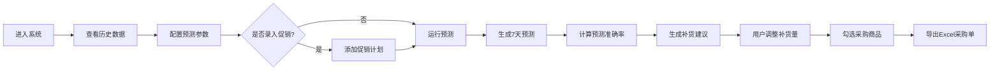

## 1. 产品概述
零售门店销售预测与补货模拟工具，帮助门店运营人员基于历史销售数据进行科学预测与智能补货决策。
- 面向门店店长、采购人员，解决凭经验订货导致的库存积压或缺货问题
- 通过数据驱动的预测算法，提升库存周转率，降低运营成本

## 2. 核心功能

### 2.1 功能模块
1. **参数配置区**：预测算法选择、窗口大小设置、全局参数配置
2. **历史数据展示区**：10种代表性SKU的30天历史销售数据可视化
3. **预测结果区**：未来7天销量预测、预测准确率对比
4. **补货建议区**：智能补货量计算、手动调整、整箱规格适配
5. **库存分析区**：库存周转率计算、滞销品红色标记
6. **促销计划区**：促销活动录入、预测销量智能调整
7. **采购单导出区**：Excel采购单一键生成

### 2.2 页面详情
| 页面名称 | 模块名称 | 功能描述 |
|-----------|-------------|---------------------|
| 主工作台 | 参数配置面板 | 选择预测算法（移动平均/指数平滑）、设置窗口大小（3/5/7天）、配置安全库存系数、整箱规格全局默认值 |
| 主工作台 | 历史数据表格 | 展示10种SKU的名称、分类、单价、当前库存、日均销量、迷你折线图 |
| 主工作台 | 预测结果表格 | 展示未来7天逐日预测销量、总预测、真实值（隐藏对比）、准确率百分比 |
| 主工作台 | 补货建议表格 | 安全库存、预测总需求、建议补货量、可编辑补货量、整箱数量 |
| 主工作台 | 库存分析列 | 月均销量、平均库存、周转率、滞销品高亮标记 |
| 主工作台 | 促销计划弹窗 | 选择SKU、选择日期、设置折扣率、促销影响系数配置 |
| 主工作台 | 采购单导出 | 汇总选中SKU、生成Excel格式采购单、下载 |

## 3. 核心流程

用户进入系统 → 查看历史销售数据概览 → 配置预测参数 → （可选）录入促销计划 → 点击运行预测 → 查看预测结果与准确率 → 系统自动生成补货建议 → 用户手动调整补货量 → 勾选需要采购的商品 → 点击导出Excel采购单

## 4. 用户界面设计

### 4.1 设计风格
- **主色调**：深海军蓝 (#0A2342) 作为主色，搭配商务橙 (#FF6B35) 作为强调色
- **辅助色**：成功绿 (#2ECC71)、警告红 (#E74C3C)、信息蓝 (#3498DB)
- **布局风格**：顶部导航 + 三栏卡片式布局（左参数、中数据表格、右分析面板）
- **字体选择**：标题使用 Playfair Display（优雅衬线），正文使用 Space Mono（等宽数字，利于数据展示）
- **按钮风格**：圆润胶囊形按钮，带微妙阴影和悬浮上浮效果
- **图标风格**：使用 Lucide 线性图标，简洁商务
- **视觉细节**：数据表格使用斑马纹，周转率低的行加红色渐变背景，数字使用千分位格式化

### 4.2 页面设计概述
| 页面名称 | 模块名称 | UI元素 |
|-----------|-------------|-------------|
| 主工作台 | 顶部导航 | 品牌Logo、系统名称、当前日期、导出按钮 |
| 主工作台 | 参数配置卡 | 算法下拉选择、窗口大小单选组、安全库存滑块、整箱规格输入 |
| 主工作台 | 主数据表头 | 搜索框、分类筛选、全选复选框 |
| 主工作台 | 数据表格 | 固定表头、横向滚动、可编辑单元格、迷你sparkline折线 |
| 主工作台 | 分析面板 | KPI卡片汇总（总库存、周转率、预测准确率）、促销计划列表 |
| 主工作台 | 弹窗 | 促销计划录入表单，带渐变遮罩层和缩放动画 |

### 4.3 响应式设计
- Desktop-first，最小宽度 1280px 体验最佳
- 1024px 以下：三栏变两栏，分析面板折叠到下方
- 768px 以下：单栏布局，表格支持横向滚动

### 4.4 动画与交互
- 页面加载：卡片依次淡入上浮（staggered animation）
- 预测运行：数据表格行逐行highlight动画显示新值
- 促销添加：弹窗缩放出现 + 背景模糊
- 数字变化：计数器滚动动画效果
