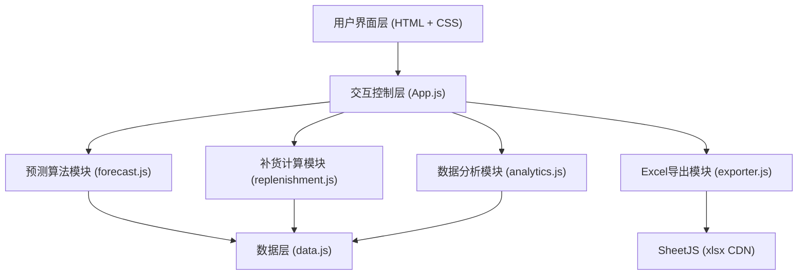

## 1. 架构设计



## 2. 技术说明
- **前端技术栈**：原生 HTML5 + CSS3 + Vanilla JavaScript (ES6+)
- **Excel导出**：通过 CDN 引入 SheetJS (xlsx) 库
- **图表可视化**：原生 Canvas 绘制迷你 Sparkline 折线图（零依赖）
- **初始化工具**：无需构建工具，直接浏览器打开运行
- **后端**：无后端，全部数据为前端内置的 JSON Mock 数据
- **数据持久化**：localStorage 保存用户配置参数

## 3. 模块文件结构
| 文件 | 用途 |
|-------|---------|
| index.html | 主页面结构，包含所有DOM布局 |
| css/style.css | 全部样式规则，CSS变量主题系统 |
| js/data.js | 10个SKU的37天销售数据（30历史+7真实）、商品基础信息 |
| js/forecast.js | 移动平均法、指数平滑法实现，促销系数调整 |
| js/analytics.js | 预测准确率计算、库存周转率计算 |
| js/replenishment.js | 安全库存、补货量计算、整箱取整 |
| js/exporter.js | 基于 SheetJS 的 Excel 采购单生成 |
| js/app.js | 主控制器，事件绑定、状态管理、模块协调 |

## 4. 数据模型

### 4.1 SKU 基础信息
```javascript
{
  id: "SKU001",
  name: "可口可乐 330ml",
  category: "饮料",
  unitPrice: 3.5,
  caseSize: 24,          // 每箱数量
  safetyStockDays: 3,    // 安全库存天数
  currentStock: 120,     // 当前库存
  avgStockMonth: 150,    // 月平均库存
  promotionElasticity: 1.5  // 促销弹性系数（折扣1% 销量增加%）
}
```

### 4.2 销售数据结构
```javascript
{
  skuId: "SKU001",
  history: [/* 长度30，逐日销量 */],
  actualFuture: [/* 长度7，未来真实销量，用于对比 */]
}
```

### 4.3 预测参数
```javascript
{
  method: "movingAverage", // "movingAverage" | "exponentialSmoothing"
  windowSize: 5,          // 3 | 5 | 7
  alpha: 0.3,             // 指数平滑系数
  globalCaseSize: 12,     // 全局默认每箱数
  globalSafetyDays: 3     // 全局安全库存天数
}
```

### 4.4 促销计划
```javascript
{
  id: "PROMO001",
  skuId: "SKU001",
  date: "2026-06-20",
  discount: 0.8,          // 8折
  impactFactor: 1.5       // 销量乘数
}
```

### 4.5 补货建议
```javascript
{
  skuId: "SKU001",
  forecast7Days: [/* 7天预测 */],
  totalForecast: 150,
  safetyStock: 20,
  currentStock: 45,
  suggestedQty: 125,      // (总预测+安全库存-当前库存)
  adjustedQty: 144,       // 用户调整后，整箱取整
  cases: 6,               // 整箱数
  turnoverRate: 2.3,      // 周转率
  isSlowMoving: false     // 是否滞销
}
```

## 5. 核心算法说明

### 5.1 移动平均法 (Moving Average)
```
forecast[t] = (actual[t-1] + actual[t-2] + ... + actual[t-N]) / N
其中 N = windowSize
```

### 5.2 指数平滑法 (Exponential Smoothing)
```
forecast[t] = alpha * actual[t-1] + (1-alpha) * forecast[t-1]
其中 alpha = 平滑系数，默认0.3
```

### 5.3 预测准确率 (MAPE 反向)
```
accuracy = (1 - MAPE) * 100%
MAPE = (1/n) * Σ|(actual - forecast)/actual|
```

### 5.4 库存周转率
```
月均销量 = 过去30天总销量 / 30 * 30
周转率 = 月均销量 / 平均库存
滞销判定：周转率 < 1.0 标记为红色
```

### 5.5 促销影响计算
```
促销日预测销量 = 基础预测 * (1 + (1-折扣率) * 弹性系数)
例：8折，弹性1.5 → 乘数 = 1 + 0.2*1.5 = 1.3
```
